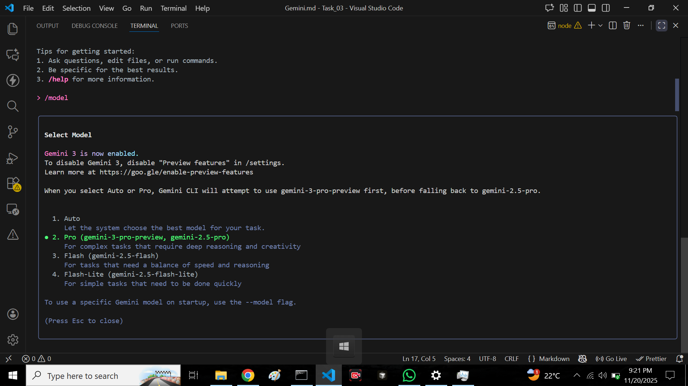

## 🌟 PART A — Research Questions 

- Question 1. What new improvements were introduced in Gemini 3.0?  
 Ans:Gemini 3.0 introduced Deep Think for strong problem solving which make Ui more interactive and creative , suppoert Agentic coding, much more understanding with text,Video, Images.

- Question 2. How does Gemini 3.0 improve coding & automation workflows?  
 Ans:gemini 3.0 now can plan , write ,run and debug code automatically, ye phely bi ho raha tha but in ner version it get more strong and clear and fast, through vibe coding you can give simple words ideas which will work with Deep think for smart logics and can work with more larger projects, with its  1Millon  token context.

- Question 3. How does Gemini 3.0 improve multimodal understanding?
 Ans:Gemini 3.0 understands text, images, videos, audio, and documents together with higher accuracy, gives better video reasoning, reads PDFs, charts, and Screeshots more clearly, and also can do image and video resolutions.

- Question 4. Name any two developer tools introduced with Gemini 3.0.?
 Ans:Many tools are introduced in Gemini 3.0 but which are being noticed and more creative are:

    - Google Antigravity – an AI coding environment where agents build and test software automatically.

    - Updated Gemini CLI – lets developers use Gemini 3 Pro directly from the terminal.(You dont need to updated all Gemini Cli for this.)

## 🌟 PART B — Practical Task 

### Task:

- Update the Gemini 3.0 

