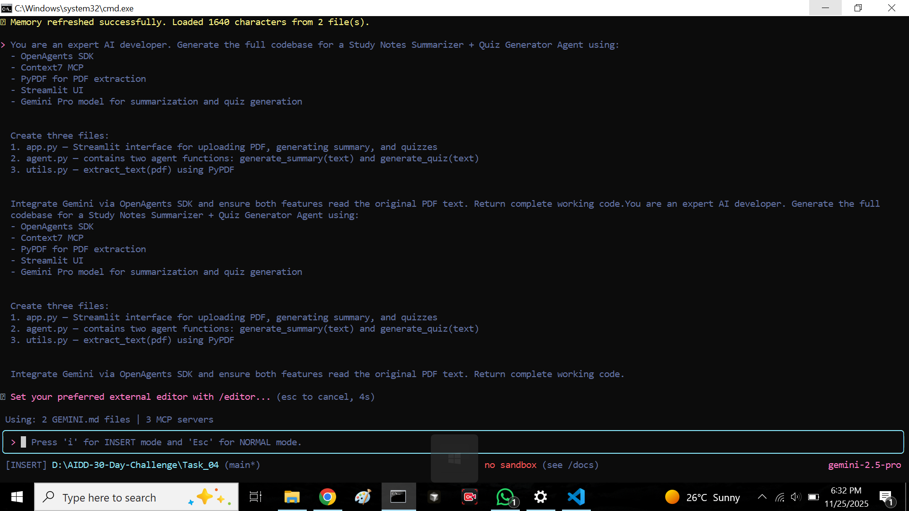

# Study Notes Summarizer & Quiz Generator Agent

This document provides the full setup, structure, and workflow for building the PDF Summarizer + Quiz Generator Agent using the following required tools:

- OpenAgents SDK

- Context7 MCP (Tool Provider)

- Gemini CLI

- PyPDF (for PDF reading)

- Streamlit (recommended UI)

## 🎯 Project Overview

You are building a dual‑feature agent that:

### ✅ A. Summarizes PDF Study Notes

- User uploads a PDF.

- PyPDF extracts text.

- Agent generates a clean structured summary using Gemini via OpenAgents SDK.

- Summary is displayed in a UI component (cards, blocks, containers—your choice).

### ✅ B. Creates Quizzes From PDF Content

- After summary is generated, user clicks Create Quiz.

- Agent again reads original PDF text (NOT the summary).

- Generates MCQs or mixed quiz formats.

These two features are minimum mandatory requirements.

## 📦 Project Requirements
Python Packages

- Install required libraries: uv\pip install streamlit pypdf openai-agents


## 🧩 Folder Structure (Recommended)
```
project/
│
├── GEMINI.md
├── .env
├── app.py # Streamlit UI
├── agent.py # Summarizer + Quiz generator agent
└── utils.py # PDF loader + helper functions
```

## 🔧 Required MCP Tools

Make sure you have these active:

- context7 (tool provider)

- gemini-pro via OpenAgents

- filesystem (if saving PDFs)

## 🚀 CLI Automation Prompt
Use the following prompt in Gemini CLI to auto‑generate all files and code for the full working agent:

