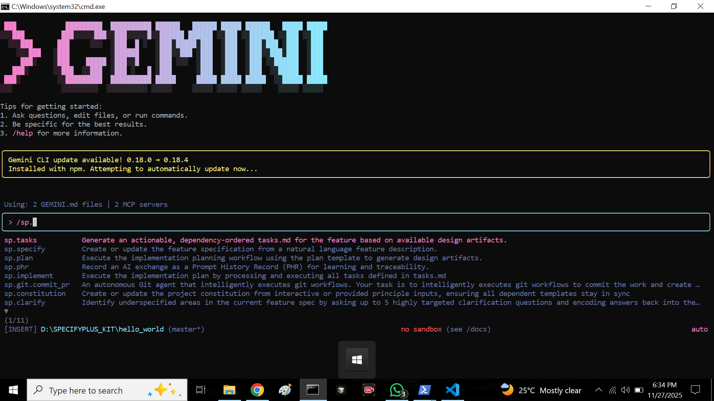

# SPECKit Plus

## 📘 What is SPECKit Plus?
SPECKit Plus is a structured development framework that helps break down any project into simple, manageable steps. It ensures clarity from understanding the project's purpose to planning, creating tasks, and finally implementing the solution.

# 📂 Core Concepts of SPECKit Plus

Below are the five main components included in SPECKit Plus with short explanations.

## 1️⃣ /constitution – Project Definition
Constitution defines the core purpose of the project. It explains what the project is, why it’s needed, and the main problem it solves. This provides a strong foundation before development begins.

## 2️⃣ /specify – Requirements & Details
This Concept defines tha Lists of the specific requirements of the project, including features, rules, inputs, outputs, and constraints. This ensures clarity on exactly what needs to be built.

## 3️⃣ /plan – Strategy & Roadmap

Plan is strategy and Outlines about how the project will be completed. It includes strategy, timeline, tools, dependencies, and overall execution roadmap.

## 4️⃣ /tasks – Work Breakdown

In this concept it breaks the project into smaller tasks with clear responsibilities and deadlines. Helps track progress and ensures work is organized.

## 5️⃣ /implement – Build & Execute

This is the development stage where planned tasks are executed. Features are coded, tested, and integrated to build the final product.

# SPECKit Plus
